Cancer Data
================
Mburu
January 26, 2019

  - [***Data Set***](#data-set)
  - [***Visualization and Feature
    selection***](#visualization-and-feature-selection)
      - [***Percentage of women with malignant
        tumor***](#percentage-of-women-with-malignant-tumor)
      - [***Boxplots***](#boxplots)
      - [***Features Scaling***](#features-scaling)
      - [***Correlation matrix***](#correlation-matrix)
      - [***Principle Component
        Analysis***](#principle-component-analysis)
      - [***Variance Explained***](#variance-explained)
      - [***Scree plot***](#scree-plot)
      - [***Cumulative Variance
        Explained***](#cumulative-variance-explained)
      - [***Construct new data set***](#construct-new-data-set)
  - [***Model Fitting***](#model-fitting)
      - [***Logistic regression***](#logistic-regression)
      - [***Regularization in logistic
        regression***](#regularization-in-logistic-regression)
      - [***SVM***](#svm)
      - [***Tuning SVM***](#tuning-svm)
      - [***Xgboost***](#xgboost)
      - [***Learning Curves***](#learning-curves)
      - [***Error Analysis***](#error-analysis)

# ***Data Set***

In this tutorial I’m going to predict whether a breast cancer tumor is
benign or malignant. Using [Wiscosin breast cancer data
set](https://www.kaggle.com/uciml/breast-cancer-wisconsin-data)
available on Kaggle. The 30 predictors are divided into three parts
first is Mean ( variables 3-13), Standard Error(13-23) and Worst(23-32)
and each contain 10 parameter (radius, texture,area, perimeter,
smoothness,compactness,concavity,concave points,symmetry and fractal
dimension of the tumor). When predicting cancer breast tumor types there
two types of cost;

  - The cost of telling someone who has malignant tumor that they have
    benign these are the false negatives in this case someone might not
    seek medical help which is can cause death.
  - Telling someone that they have malignant type of tumor but they
    don’t which is usually false positives. In this case you subject
    someone to unnecessary stress

So it’s highly desirable that our model has good accuracy $ f\_1 score$
and high recall.

``` r
library(tidyverse)
library(data.table)
library(xgboost)
library(knitr)
library(broom)
library(caret)
library(e1071)
library(kableExtra)
library(ggthemes)

library(glmnet)

cancer <- setDT(read_csv("data.csv"))

cancer[, X33 := NULL]
```

``` r
head(cancer)  %>%
  kable() 
```

<table>

<thead>

<tr>

<th style="text-align:right;">

id

</th>

<th style="text-align:left;">

diagnosis

</th>

<th style="text-align:right;">

radius\_mean

</th>

<th style="text-align:right;">

texture\_mean

</th>

<th style="text-align:right;">

perimeter\_mean

</th>

<th style="text-align:right;">

area\_mean

</th>

<th style="text-align:right;">

smoothness\_mean

</th>

<th style="text-align:right;">

compactness\_mean

</th>

<th style="text-align:right;">

concavity\_mean

</th>

<th style="text-align:right;">

concave points\_mean

</th>

<th style="text-align:right;">

symmetry\_mean

</th>

<th style="text-align:right;">

fractal\_dimension\_mean

</th>

<th style="text-align:right;">

radius\_se

</th>

<th style="text-align:right;">

texture\_se

</th>

<th style="text-align:right;">

perimeter\_se

</th>

<th style="text-align:right;">

area\_se

</th>

<th style="text-align:right;">

smoothness\_se

</th>

<th style="text-align:right;">

compactness\_se

</th>

<th style="text-align:right;">

concavity\_se

</th>

<th style="text-align:right;">

concave points\_se

</th>

<th style="text-align:right;">

symmetry\_se

</th>

<th style="text-align:right;">

fractal\_dimension\_se

</th>

<th style="text-align:right;">

radius\_worst

</th>

<th style="text-align:right;">

texture\_worst

</th>

<th style="text-align:right;">

perimeter\_worst

</th>

<th style="text-align:right;">

area\_worst

</th>

<th style="text-align:right;">

smoothness\_worst

</th>

<th style="text-align:right;">

compactness\_worst

</th>

<th style="text-align:right;">

concavity\_worst

</th>

<th style="text-align:right;">

concave points\_worst

</th>

<th style="text-align:right;">

symmetry\_worst

</th>

<th style="text-align:right;">

fractal\_dimension\_worst

</th>

</tr>

</thead>

<tbody>

<tr>

<td style="text-align:right;">

842302

</td>

<td style="text-align:left;">

M

</td>

<td style="text-align:right;">

17.99

</td>

<td style="text-align:right;">

10.38

</td>

<td style="text-align:right;">

122.80

</td>

<td style="text-align:right;">

1001.0

</td>

<td style="text-align:right;">

0.11840

</td>

<td style="text-align:right;">

0.27760

</td>

<td style="text-align:right;">

0.3001

</td>

<td style="text-align:right;">

0.14710

</td>

<td style="text-align:right;">

0.2419

</td>

<td style="text-align:right;">

0.07871

</td>

<td style="text-align:right;">

1.0950

</td>

<td style="text-align:right;">

0.9053

</td>

<td style="text-align:right;">

8.589

</td>

<td style="text-align:right;">

153.40

</td>

<td style="text-align:right;">

0.006399

</td>

<td style="text-align:right;">

0.04904

</td>

<td style="text-align:right;">

0.05373

</td>

<td style="text-align:right;">

0.01587

</td>

<td style="text-align:right;">

0.03003

</td>

<td style="text-align:right;">

0.006193

</td>

<td style="text-align:right;">

25.38

</td>

<td style="text-align:right;">

17.33

</td>

<td style="text-align:right;">

184.60

</td>

<td style="text-align:right;">

2019.0

</td>

<td style="text-align:right;">

0.1622

</td>

<td style="text-align:right;">

0.6656

</td>

<td style="text-align:right;">

0.7119

</td>

<td style="text-align:right;">

0.2654

</td>

<td style="text-align:right;">

0.4601

</td>

<td style="text-align:right;">

0.11890

</td>

</tr>

<tr>

<td style="text-align:right;">

842517

</td>

<td style="text-align:left;">

M

</td>

<td style="text-align:right;">

20.57

</td>

<td style="text-align:right;">

17.77

</td>

<td style="text-align:right;">

132.90

</td>

<td style="text-align:right;">

1326.0

</td>

<td style="text-align:right;">

0.08474

</td>

<td style="text-align:right;">

0.07864

</td>

<td style="text-align:right;">

0.0869

</td>

<td style="text-align:right;">

0.07017

</td>

<td style="text-align:right;">

0.1812

</td>

<td style="text-align:right;">

0.05667

</td>

<td style="text-align:right;">

0.5435

</td>

<td style="text-align:right;">

0.7339

</td>

<td style="text-align:right;">

3.398

</td>

<td style="text-align:right;">

74.08

</td>

<td style="text-align:right;">

0.005225

</td>

<td style="text-align:right;">

0.01308

</td>

<td style="text-align:right;">

0.01860

</td>

<td style="text-align:right;">

0.01340

</td>

<td style="text-align:right;">

0.01389

</td>

<td style="text-align:right;">

0.003532

</td>

<td style="text-align:right;">

24.99

</td>

<td style="text-align:right;">

23.41

</td>

<td style="text-align:right;">

158.80

</td>

<td style="text-align:right;">

1956.0

</td>

<td style="text-align:right;">

0.1238

</td>

<td style="text-align:right;">

0.1866

</td>

<td style="text-align:right;">

0.2416

</td>

<td style="text-align:right;">

0.1860

</td>

<td style="text-align:right;">

0.2750

</td>

<td style="text-align:right;">

0.08902

</td>

</tr>

<tr>

<td style="text-align:right;">

84300903

</td>

<td style="text-align:left;">

M

</td>

<td style="text-align:right;">

19.69

</td>

<td style="text-align:right;">

21.25

</td>

<td style="text-align:right;">

130.00

</td>

<td style="text-align:right;">

1203.0

</td>

<td style="text-align:right;">

0.10960

</td>

<td style="text-align:right;">

0.15990

</td>

<td style="text-align:right;">

0.1974

</td>

<td style="text-align:right;">

0.12790

</td>

<td style="text-align:right;">

0.2069

</td>

<td style="text-align:right;">

0.05999

</td>

<td style="text-align:right;">

0.7456

</td>

<td style="text-align:right;">

0.7869

</td>

<td style="text-align:right;">

4.585

</td>

<td style="text-align:right;">

94.03

</td>

<td style="text-align:right;">

0.006150

</td>

<td style="text-align:right;">

0.04006

</td>

<td style="text-align:right;">

0.03832

</td>

<td style="text-align:right;">

0.02058

</td>

<td style="text-align:right;">

0.02250

</td>

<td style="text-align:right;">

0.004571

</td>

<td style="text-align:right;">

23.57

</td>

<td style="text-align:right;">

25.53

</td>

<td style="text-align:right;">

152.50

</td>

<td style="text-align:right;">

1709.0

</td>

<td style="text-align:right;">

0.1444

</td>

<td style="text-align:right;">

0.4245

</td>

<td style="text-align:right;">

0.4504

</td>

<td style="text-align:right;">

0.2430

</td>

<td style="text-align:right;">

0.3613

</td>

<td style="text-align:right;">

0.08758

</td>

</tr>

<tr>

<td style="text-align:right;">

84348301

</td>

<td style="text-align:left;">

M

</td>

<td style="text-align:right;">

11.42

</td>

<td style="text-align:right;">

20.38

</td>

<td style="text-align:right;">

77.58

</td>

<td style="text-align:right;">

386.1

</td>

<td style="text-align:right;">

0.14250

</td>

<td style="text-align:right;">

0.28390

</td>

<td style="text-align:right;">

0.2414

</td>

<td style="text-align:right;">

0.10520

</td>

<td style="text-align:right;">

0.2597

</td>

<td style="text-align:right;">

0.09744

</td>

<td style="text-align:right;">

0.4956

</td>

<td style="text-align:right;">

1.1560

</td>

<td style="text-align:right;">

3.445

</td>

<td style="text-align:right;">

27.23

</td>

<td style="text-align:right;">

0.009110

</td>

<td style="text-align:right;">

0.07458

</td>

<td style="text-align:right;">

0.05661

</td>

<td style="text-align:right;">

0.01867

</td>

<td style="text-align:right;">

0.05963

</td>

<td style="text-align:right;">

0.009208

</td>

<td style="text-align:right;">

14.91

</td>

<td style="text-align:right;">

26.50

</td>

<td style="text-align:right;">

98.87

</td>

<td style="text-align:right;">

567.7

</td>

<td style="text-align:right;">

0.2098

</td>

<td style="text-align:right;">

0.8663

</td>

<td style="text-align:right;">

0.6869

</td>

<td style="text-align:right;">

0.2575

</td>

<td style="text-align:right;">

0.6638

</td>

<td style="text-align:right;">

0.17300

</td>

</tr>

<tr>

<td style="text-align:right;">

84358402

</td>

<td style="text-align:left;">

M

</td>

<td style="text-align:right;">

20.29

</td>

<td style="text-align:right;">

14.34

</td>

<td style="text-align:right;">

135.10

</td>

<td style="text-align:right;">

1297.0

</td>

<td style="text-align:right;">

0.10030

</td>

<td style="text-align:right;">

0.13280

</td>

<td style="text-align:right;">

0.1980

</td>

<td style="text-align:right;">

0.10430

</td>

<td style="text-align:right;">

0.1809

</td>

<td style="text-align:right;">

0.05883

</td>

<td style="text-align:right;">

0.7572

</td>

<td style="text-align:right;">

0.7813

</td>

<td style="text-align:right;">

5.438

</td>

<td style="text-align:right;">

94.44

</td>

<td style="text-align:right;">

0.011490

</td>

<td style="text-align:right;">

0.02461

</td>

<td style="text-align:right;">

0.05688

</td>

<td style="text-align:right;">

0.01885

</td>

<td style="text-align:right;">

0.01756

</td>

<td style="text-align:right;">

0.005115

</td>

<td style="text-align:right;">

22.54

</td>

<td style="text-align:right;">

16.67

</td>

<td style="text-align:right;">

152.20

</td>

<td style="text-align:right;">

1575.0

</td>

<td style="text-align:right;">

0.1374

</td>

<td style="text-align:right;">

0.2050

</td>

<td style="text-align:right;">

0.4000

</td>

<td style="text-align:right;">

0.1625

</td>

<td style="text-align:right;">

0.2364

</td>

<td style="text-align:right;">

0.07678

</td>

</tr>

<tr>

<td style="text-align:right;">

843786

</td>

<td style="text-align:left;">

M

</td>

<td style="text-align:right;">

12.45

</td>

<td style="text-align:right;">

15.70

</td>

<td style="text-align:right;">

82.57

</td>

<td style="text-align:right;">

477.1

</td>

<td style="text-align:right;">

0.12780

</td>

<td style="text-align:right;">

0.17000

</td>

<td style="text-align:right;">

0.1578

</td>

<td style="text-align:right;">

0.08089

</td>

<td style="text-align:right;">

0.2087

</td>

<td style="text-align:right;">

0.07613

</td>

<td style="text-align:right;">

0.3345

</td>

<td style="text-align:right;">

0.8902

</td>

<td style="text-align:right;">

2.217

</td>

<td style="text-align:right;">

27.19

</td>

<td style="text-align:right;">

0.007510

</td>

<td style="text-align:right;">

0.03345

</td>

<td style="text-align:right;">

0.03672

</td>

<td style="text-align:right;">

0.01137

</td>

<td style="text-align:right;">

0.02165

</td>

<td style="text-align:right;">

0.005082

</td>

<td style="text-align:right;">

15.47

</td>

<td style="text-align:right;">

23.75

</td>

<td style="text-align:right;">

103.40

</td>

<td style="text-align:right;">

741.6

</td>

<td style="text-align:right;">

0.1791

</td>

<td style="text-align:right;">

0.5249

</td>

<td style="text-align:right;">

0.5355

</td>

<td style="text-align:right;">

0.1741

</td>

<td style="text-align:right;">

0.3985

</td>

<td style="text-align:right;">

0.12440

</td>

</tr>

</tbody>

</table>

# ***Visualization and Feature selection***

## ***Percentage of women with malignant tumor***

The percentage of women with malignant tumor is 37.26%(212 out 569)
while the rest 62.74%(357) had benign tumors.

``` r
cancer[, .(freq = .N),
       by = diagnosis] %>% 
    .[, perc := round(100 * freq/sum(freq), 2)] %>%
  
ggplot(aes(x=diagnosis, y=perc, fill = diagnosis)) + 
    geom_bar(stat = "identity", width  = 0.5)+ theme_hc() +
    geom_text(aes(x=diagnosis, y=perc, label = paste(perc, "%")),
              position =  position_dodge(width = 0.5),
              vjust = 0.05, hjust = 0.5, size = 5)+
    scale_fill_hc(name = "")+
    labs(x = "Cancer Type",
         y = "Percentage",
         title = "Percentage of women with benign or malignant breast bancer")+
    theme(legend.position = "none",
          axis.title = element_text(size =12))
```

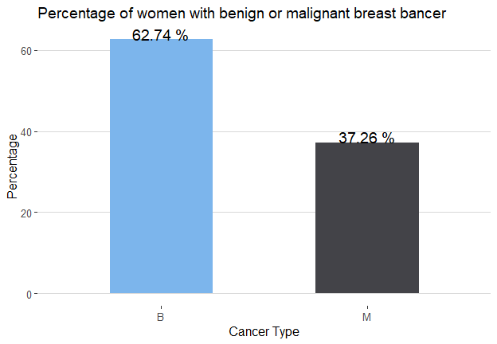<!-- -->

## ***Boxplots***

From the boxplots we can identify variables where we expect there is a
significance difference between the two groups of cancer tumors. When
using a boxplot if two distributions do not averlap or more than 75% of
two boxplot do not overlap then we expect that there is a significance
difference in the mean/median between the two groups. Some of the
variables where the distribution of two cancer tumors are significantly
different are radius\_mean, texture\_mean etc. The visible differences
between malignant tumors and benign tumors can be seen in means of all
cells and worst means where worst means is the average of all the worst
cells. The distribution of malignant tumors have higher scores than the
benign tumors in this cases.

``` r
cancerm <- melt(cancer[, -1, with = F], id.vars = "diagnosis")

ggplot(cancerm, aes(x = diagnosis, y = value))+
    geom_boxplot() + facet_wrap(~variable, scales = "free_y")
```

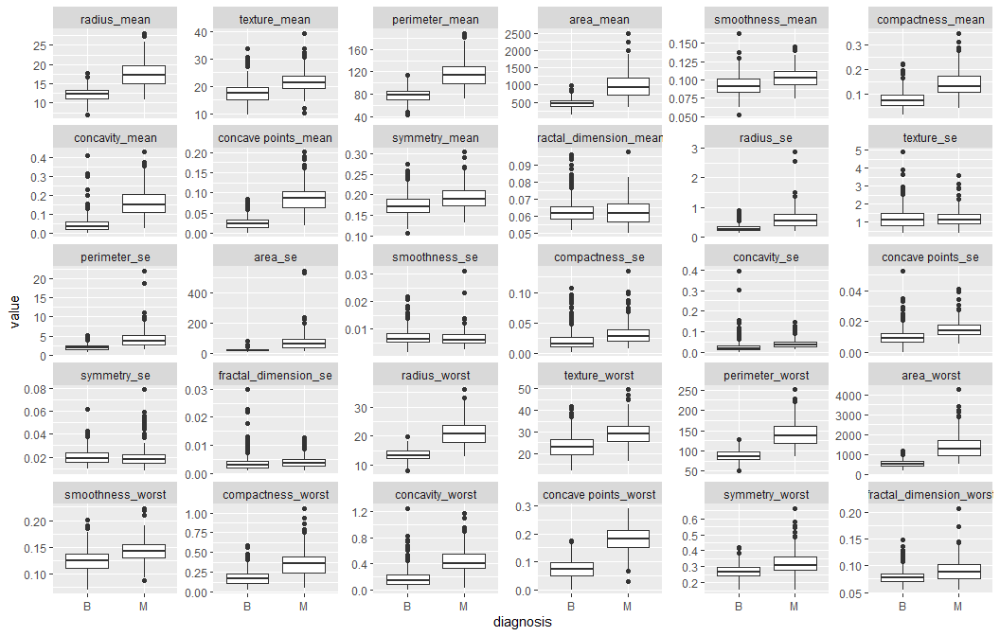<!-- -->

## ***Features Scaling***

We find that some variables are highly correlated. We can use principle
component analysis for dimension reduction. Since variables are
correlated it’s evident that we can use a smaller set of features to
build our models.

``` r
cancer[, id := NULL]
predictors <- names(cancer)[3:31]
cancer[, (predictors) := lapply(.SD, function(x) scale(x)), .SDcols = predictors ]
cancer[, diagnosis := as.factor(diagnosis)]
```

## ***Correlation matrix***

``` r
cor(cancer[, -(1:2), with = F]) %>% kable(format = "html") 
```

<table>

<thead>

<tr>

<th style="text-align:left;">

</th>

<th style="text-align:right;">

texture\_mean

</th>

<th style="text-align:right;">

perimeter\_mean

</th>

<th style="text-align:right;">

area\_mean

</th>

<th style="text-align:right;">

smoothness\_mean

</th>

<th style="text-align:right;">

compactness\_mean

</th>

<th style="text-align:right;">

concavity\_mean

</th>

<th style="text-align:right;">

concave points\_mean

</th>

<th style="text-align:right;">

symmetry\_mean

</th>

<th style="text-align:right;">

fractal\_dimension\_mean

</th>

<th style="text-align:right;">

radius\_se

</th>

<th style="text-align:right;">

texture\_se

</th>

<th style="text-align:right;">

perimeter\_se

</th>

<th style="text-align:right;">

area\_se

</th>

<th style="text-align:right;">

smoothness\_se

</th>

<th style="text-align:right;">

compactness\_se

</th>

<th style="text-align:right;">

concavity\_se

</th>

<th style="text-align:right;">

concave points\_se

</th>

<th style="text-align:right;">

symmetry\_se

</th>

<th style="text-align:right;">

fractal\_dimension\_se

</th>

<th style="text-align:right;">

radius\_worst

</th>

<th style="text-align:right;">

texture\_worst

</th>

<th style="text-align:right;">

perimeter\_worst

</th>

<th style="text-align:right;">

area\_worst

</th>

<th style="text-align:right;">

smoothness\_worst

</th>

<th style="text-align:right;">

compactness\_worst

</th>

<th style="text-align:right;">

concavity\_worst

</th>

<th style="text-align:right;">

concave points\_worst

</th>

<th style="text-align:right;">

symmetry\_worst

</th>

<th style="text-align:right;">

fractal\_dimension\_worst

</th>

</tr>

</thead>

<tbody>

<tr>

<td style="text-align:left;">

texture\_mean

</td>

<td style="text-align:right;">

1.0000000

</td>

<td style="text-align:right;">

0.3295331

</td>

<td style="text-align:right;">

0.3210857

</td>

<td style="text-align:right;">

\-0.0233885

</td>

<td style="text-align:right;">

0.2367022

</td>

<td style="text-align:right;">

0.3024178

</td>

<td style="text-align:right;">

0.2934641

</td>

<td style="text-align:right;">

0.0714010

</td>

<td style="text-align:right;">

\-0.0764372

</td>

<td style="text-align:right;">

0.2758687

</td>

<td style="text-align:right;">

0.3863576

</td>

<td style="text-align:right;">

0.2816731

</td>

<td style="text-align:right;">

0.2598450

</td>

<td style="text-align:right;">

0.0066138

</td>

<td style="text-align:right;">

0.1919746

</td>

<td style="text-align:right;">

0.1432931

</td>

<td style="text-align:right;">

0.1638510

</td>

<td style="text-align:right;">

0.0091272

</td>

<td style="text-align:right;">

0.0544575

</td>

<td style="text-align:right;">

0.3525729

</td>

<td style="text-align:right;">

0.9120446

</td>

<td style="text-align:right;">

0.3580396

</td>

<td style="text-align:right;">

0.3435459

</td>

<td style="text-align:right;">

0.0775034

</td>

<td style="text-align:right;">

0.2778296

</td>

<td style="text-align:right;">

0.3010252

</td>

<td style="text-align:right;">

0.2953158

</td>

<td style="text-align:right;">

0.1050079

</td>

<td style="text-align:right;">

0.1192054

</td>

</tr>

<tr>

<td style="text-align:left;">

perimeter\_mean

</td>

<td style="text-align:right;">

0.3295331

</td>

<td style="text-align:right;">

1.0000000

</td>

<td style="text-align:right;">

0.9865068

</td>

<td style="text-align:right;">

0.2072782

</td>

<td style="text-align:right;">

0.5569362

</td>

<td style="text-align:right;">

0.7161357

</td>

<td style="text-align:right;">

0.8509770

</td>

<td style="text-align:right;">

0.1830272

</td>

<td style="text-align:right;">

\-0.2614769

</td>

<td style="text-align:right;">

0.6917650

</td>

<td style="text-align:right;">

\-0.0867611

</td>

<td style="text-align:right;">

0.6931349

</td>

<td style="text-align:right;">

0.7449827

</td>

<td style="text-align:right;">

\-0.2026940

</td>

<td style="text-align:right;">

0.2507437

</td>

<td style="text-align:right;">

0.2280823

</td>

<td style="text-align:right;">

0.4072169

</td>

<td style="text-align:right;">

\-0.0816293

</td>

<td style="text-align:right;">

\-0.0055234

</td>

<td style="text-align:right;">

0.9694764

</td>

<td style="text-align:right;">

0.3030384

</td>

<td style="text-align:right;">

0.9703869

</td>

<td style="text-align:right;">

0.9415498

</td>

<td style="text-align:right;">

0.1505494

</td>

<td style="text-align:right;">

0.4557742

</td>

<td style="text-align:right;">

0.5638793

</td>

<td style="text-align:right;">

0.7712408

</td>

<td style="text-align:right;">

0.1891150

</td>

<td style="text-align:right;">

0.0510185

</td>

</tr>

<tr>

<td style="text-align:left;">

area\_mean

</td>

<td style="text-align:right;">

0.3210857

</td>

<td style="text-align:right;">

0.9865068

</td>

<td style="text-align:right;">

1.0000000

</td>

<td style="text-align:right;">

0.1770284

</td>

<td style="text-align:right;">

0.4985017

</td>

<td style="text-align:right;">

0.6859828

</td>

<td style="text-align:right;">

0.8232689

</td>

<td style="text-align:right;">

0.1512931

</td>

<td style="text-align:right;">

\-0.2831098

</td>

<td style="text-align:right;">

0.7325622

</td>

<td style="text-align:right;">

\-0.0662802

</td>

<td style="text-align:right;">

0.7266283

</td>

<td style="text-align:right;">

0.8000859

</td>

<td style="text-align:right;">

\-0.1667767

</td>

<td style="text-align:right;">

0.2125826

</td>

<td style="text-align:right;">

0.2076601

</td>

<td style="text-align:right;">

0.3723203

</td>

<td style="text-align:right;">

\-0.0724966

</td>

<td style="text-align:right;">

\-0.0198870

</td>

<td style="text-align:right;">

0.9627461

</td>

<td style="text-align:right;">

0.2874886

</td>

<td style="text-align:right;">

0.9591196

</td>

<td style="text-align:right;">

0.9592133

</td>

<td style="text-align:right;">

0.1235229

</td>

<td style="text-align:right;">

0.3904103

</td>

<td style="text-align:right;">

0.5126059

</td>

<td style="text-align:right;">

0.7220166

</td>

<td style="text-align:right;">

0.1435699

</td>

<td style="text-align:right;">

0.0037376

</td>

</tr>

<tr>

<td style="text-align:left;">

smoothness\_mean

</td>

<td style="text-align:right;">

\-0.0233885

</td>

<td style="text-align:right;">

0.2072782

</td>

<td style="text-align:right;">

0.1770284

</td>

<td style="text-align:right;">

1.0000000

</td>

<td style="text-align:right;">

0.6591232

</td>

<td style="text-align:right;">

0.5219838

</td>

<td style="text-align:right;">

0.5536952

</td>

<td style="text-align:right;">

0.5577748

</td>

<td style="text-align:right;">

0.5847920

</td>

<td style="text-align:right;">

0.3014671

</td>

<td style="text-align:right;">

0.0684064

</td>

<td style="text-align:right;">

0.2960919

</td>

<td style="text-align:right;">

0.2465524

</td>

<td style="text-align:right;">

0.3323754

</td>

<td style="text-align:right;">

0.3189433

</td>

<td style="text-align:right;">

0.2483957

</td>

<td style="text-align:right;">

0.3806757

</td>

<td style="text-align:right;">

0.2007744

</td>

<td style="text-align:right;">

0.2836067

</td>

<td style="text-align:right;">

0.2131201

</td>

<td style="text-align:right;">

0.0360718

</td>

<td style="text-align:right;">

0.2388526

</td>

<td style="text-align:right;">

0.2067184

</td>

<td style="text-align:right;">

0.8053242

</td>

<td style="text-align:right;">

0.4724684

</td>

<td style="text-align:right;">

0.4349257

</td>

<td style="text-align:right;">

0.5030534

</td>

<td style="text-align:right;">

0.3943095

</td>

<td style="text-align:right;">

0.4993164

</td>

</tr>

<tr>

<td style="text-align:left;">

compactness\_mean

</td>

<td style="text-align:right;">

0.2367022

</td>

<td style="text-align:right;">

0.5569362

</td>

<td style="text-align:right;">

0.4985017

</td>

<td style="text-align:right;">

0.6591232

</td>

<td style="text-align:right;">

1.0000000

</td>

<td style="text-align:right;">

0.8831207

</td>

<td style="text-align:right;">

0.8311350

</td>

<td style="text-align:right;">

0.6026410

</td>

<td style="text-align:right;">

0.5653687

</td>

<td style="text-align:right;">

0.4974734

</td>

<td style="text-align:right;">

0.0462048

</td>

<td style="text-align:right;">

0.5489053

</td>

<td style="text-align:right;">

0.4556529

</td>

<td style="text-align:right;">

0.1352993

</td>

<td style="text-align:right;">

0.7387218

</td>

<td style="text-align:right;">

0.5705169

</td>

<td style="text-align:right;">

0.6422619

</td>

<td style="text-align:right;">

0.2299766

</td>

<td style="text-align:right;">

0.5073181

</td>

<td style="text-align:right;">

0.5353154

</td>

<td style="text-align:right;">

0.2481328

</td>

<td style="text-align:right;">

0.5902104

</td>

<td style="text-align:right;">

0.5096038

</td>

<td style="text-align:right;">

0.5655412

</td>

<td style="text-align:right;">

0.8658090

</td>

<td style="text-align:right;">

0.8162752

</td>

<td style="text-align:right;">

0.8155732

</td>

<td style="text-align:right;">

0.5102234

</td>

<td style="text-align:right;">

0.6873823

</td>

</tr>

<tr>

<td style="text-align:left;">

concavity\_mean

</td>

<td style="text-align:right;">

0.3024178

</td>

<td style="text-align:right;">

0.7161357

</td>

<td style="text-align:right;">

0.6859828

</td>

<td style="text-align:right;">

0.5219838

</td>

<td style="text-align:right;">

0.8831207

</td>

<td style="text-align:right;">

1.0000000

</td>

<td style="text-align:right;">

0.9213910

</td>

<td style="text-align:right;">

0.5006666

</td>

<td style="text-align:right;">

0.3367834

</td>

<td style="text-align:right;">

0.6319248

</td>

<td style="text-align:right;">

0.0762183

</td>

<td style="text-align:right;">

0.6603908

</td>

<td style="text-align:right;">

0.6174268

</td>

<td style="text-align:right;">

0.0985637

</td>

<td style="text-align:right;">

0.6702788

</td>

<td style="text-align:right;">

0.6912702

</td>

<td style="text-align:right;">

0.6832599

</td>

<td style="text-align:right;">

0.1780092

</td>

<td style="text-align:right;">

0.4493007

</td>

<td style="text-align:right;">

0.6882364

</td>

<td style="text-align:right;">

0.2998789

</td>

<td style="text-align:right;">

0.7295649

</td>

<td style="text-align:right;">

0.6759872

</td>

<td style="text-align:right;">

0.4488220

</td>

<td style="text-align:right;">

0.7549680

</td>

<td style="text-align:right;">

0.8841026

</td>

<td style="text-align:right;">

0.8613230

</td>

<td style="text-align:right;">

0.4094641

</td>

<td style="text-align:right;">

0.5149299

</td>

</tr>

<tr>

<td style="text-align:left;">

concave points\_mean

</td>

<td style="text-align:right;">

0.2934641

</td>

<td style="text-align:right;">

0.8509770

</td>

<td style="text-align:right;">

0.8232689

</td>

<td style="text-align:right;">

0.5536952

</td>

<td style="text-align:right;">

0.8311350

</td>

<td style="text-align:right;">

0.9213910

</td>

<td style="text-align:right;">

1.0000000

</td>

<td style="text-align:right;">

0.4624974

</td>

<td style="text-align:right;">

0.1669174

</td>

<td style="text-align:right;">

0.6980498

</td>

<td style="text-align:right;">

0.0214796

</td>

<td style="text-align:right;">

0.7106499

</td>

<td style="text-align:right;">

0.6902985

</td>

<td style="text-align:right;">

0.0276533

</td>

<td style="text-align:right;">

0.4904242

</td>

<td style="text-align:right;">

0.4391671

</td>

<td style="text-align:right;">

0.6156341

</td>

<td style="text-align:right;">

0.0953508

</td>

<td style="text-align:right;">

0.2575837

</td>

<td style="text-align:right;">

0.8303176

</td>

<td style="text-align:right;">

0.2927517

</td>

<td style="text-align:right;">

0.8559231

</td>

<td style="text-align:right;">

0.8096296

</td>

<td style="text-align:right;">

0.4527531

</td>

<td style="text-align:right;">

0.6674537

</td>

<td style="text-align:right;">

0.7523995

</td>

<td style="text-align:right;">

0.9101553

</td>

<td style="text-align:right;">

0.3757441

</td>

<td style="text-align:right;">

0.3686611

</td>

</tr>

<tr>

<td style="text-align:left;">

symmetry\_mean

</td>

<td style="text-align:right;">

0.0714010

</td>

<td style="text-align:right;">

0.1830272

</td>

<td style="text-align:right;">

0.1512931

</td>

<td style="text-align:right;">

0.5577748

</td>

<td style="text-align:right;">

0.6026410

</td>

<td style="text-align:right;">

0.5006666

</td>

<td style="text-align:right;">

0.4624974

</td>

<td style="text-align:right;">

1.0000000

</td>

<td style="text-align:right;">

0.4799213

</td>

<td style="text-align:right;">

0.3033793

</td>

<td style="text-align:right;">

0.1280529

</td>

<td style="text-align:right;">

0.3138928

</td>

<td style="text-align:right;">

0.2239702

</td>

<td style="text-align:right;">

0.1873212

</td>

<td style="text-align:right;">

0.4216591

</td>

<td style="text-align:right;">

0.3426270

</td>

<td style="text-align:right;">

0.3932979

</td>

<td style="text-align:right;">

0.4491365

</td>

<td style="text-align:right;">

0.3317861

</td>

<td style="text-align:right;">

0.1857278

</td>

<td style="text-align:right;">

0.0906507

</td>

<td style="text-align:right;">

0.2191686

</td>

<td style="text-align:right;">

0.1771934

</td>

<td style="text-align:right;">

0.4266750

</td>

<td style="text-align:right;">

0.4732000

</td>

<td style="text-align:right;">

0.4337210

</td>

<td style="text-align:right;">

0.4302966

</td>

<td style="text-align:right;">

0.6998258

</td>

<td style="text-align:right;">

0.4384135

</td>

</tr>

<tr>

<td style="text-align:left;">

fractal\_dimension\_mean

</td>

<td style="text-align:right;">

\-0.0764372

</td>

<td style="text-align:right;">

\-0.2614769

</td>

<td style="text-align:right;">

\-0.2831098

</td>

<td style="text-align:right;">

0.5847920

</td>

<td style="text-align:right;">

0.5653687

</td>

<td style="text-align:right;">

0.3367834

</td>

<td style="text-align:right;">

0.1669174

</td>

<td style="text-align:right;">

0.4799213

</td>

<td style="text-align:right;">

1.0000000

</td>

<td style="text-align:right;">

0.0001110

</td>

<td style="text-align:right;">

0.1641740

</td>

<td style="text-align:right;">

0.0398299

</td>

<td style="text-align:right;">

\-0.0901702

</td>

<td style="text-align:right;">

0.4019644

</td>

<td style="text-align:right;">

0.5598367

</td>

<td style="text-align:right;">

0.4466303

</td>

<td style="text-align:right;">

0.3411980

</td>

<td style="text-align:right;">

0.3450074

</td>

<td style="text-align:right;">

0.6881316

</td>

<td style="text-align:right;">

\-0.2536915

</td>

<td style="text-align:right;">

\-0.0512692

</td>

<td style="text-align:right;">

\-0.2051512

</td>

<td style="text-align:right;">

\-0.2318545

</td>

<td style="text-align:right;">

0.5049421

</td>

<td style="text-align:right;">

0.4587982

</td>

<td style="text-align:right;">

0.3462339

</td>

<td style="text-align:right;">

0.1753254

</td>

<td style="text-align:right;">

0.3340187

</td>

<td style="text-align:right;">

0.7672968

</td>

</tr>

<tr>

<td style="text-align:left;">

radius\_se

</td>

<td style="text-align:right;">

0.2758687

</td>

<td style="text-align:right;">

0.6917650

</td>

<td style="text-align:right;">

0.7325622

</td>

<td style="text-align:right;">

0.3014671

</td>

<td style="text-align:right;">

0.4974734

</td>

<td style="text-align:right;">

0.6319248

</td>

<td style="text-align:right;">

0.6980498

</td>

<td style="text-align:right;">

0.3033793

</td>

<td style="text-align:right;">

0.0001110

</td>

<td style="text-align:right;">

1.0000000

</td>

<td style="text-align:right;">

0.2132473

</td>

<td style="text-align:right;">

0.9727937

</td>

<td style="text-align:right;">

0.9518301

</td>

<td style="text-align:right;">

0.1645142

</td>

<td style="text-align:right;">

0.3560646

</td>

<td style="text-align:right;">

0.3323575

</td>

<td style="text-align:right;">

0.5133464

</td>

<td style="text-align:right;">

0.2405674

</td>

<td style="text-align:right;">

0.2277535

</td>

<td style="text-align:right;">

0.7150652

</td>

<td style="text-align:right;">

0.1947986

</td>

<td style="text-align:right;">

0.7196838

</td>

<td style="text-align:right;">

0.7515485

</td>

<td style="text-align:right;">

0.1419186

</td>

<td style="text-align:right;">

0.2871032

</td>

<td style="text-align:right;">

0.3805846

</td>

<td style="text-align:right;">

0.5310623

</td>

<td style="text-align:right;">

0.0945428

</td>

<td style="text-align:right;">

0.0495594

</td>

</tr>

<tr>

<td style="text-align:left;">

texture\_se

</td>

<td style="text-align:right;">

0.3863576

</td>

<td style="text-align:right;">

\-0.0867611

</td>

<td style="text-align:right;">

\-0.0662802

</td>

<td style="text-align:right;">

0.0684064

</td>

<td style="text-align:right;">

0.0462048

</td>

<td style="text-align:right;">

0.0762183

</td>

<td style="text-align:right;">

0.0214796

</td>

<td style="text-align:right;">

0.1280529

</td>

<td style="text-align:right;">

0.1641740

</td>

<td style="text-align:right;">

0.2132473

</td>

<td style="text-align:right;">

1.0000000

</td>

<td style="text-align:right;">

0.2231707

</td>

<td style="text-align:right;">

0.1115672

</td>

<td style="text-align:right;">

0.3972429

</td>

<td style="text-align:right;">

0.2316997

</td>

<td style="text-align:right;">

0.1949985

</td>

<td style="text-align:right;">

0.2302834

</td>

<td style="text-align:right;">

0.4116207

</td>

<td style="text-align:right;">

0.2797227

</td>

<td style="text-align:right;">

\-0.1116903

</td>

<td style="text-align:right;">

0.4090028

</td>

<td style="text-align:right;">

\-0.1022419

</td>

<td style="text-align:right;">

\-0.0831950

</td>

<td style="text-align:right;">

\-0.0736577

</td>

<td style="text-align:right;">

\-0.0924394

</td>

<td style="text-align:right;">

\-0.0689562

</td>

<td style="text-align:right;">

\-0.1196375

</td>

<td style="text-align:right;">

\-0.1282148

</td>

<td style="text-align:right;">

\-0.0456546

</td>

</tr>

<tr>

<td style="text-align:left;">

perimeter\_se

</td>

<td style="text-align:right;">

0.2816731

</td>

<td style="text-align:right;">

0.6931349

</td>

<td style="text-align:right;">

0.7266283

</td>

<td style="text-align:right;">

0.2960919

</td>

<td style="text-align:right;">

0.5489053

</td>

<td style="text-align:right;">

0.6603908

</td>

<td style="text-align:right;">

0.7106499

</td>

<td style="text-align:right;">

0.3138928

</td>

<td style="text-align:right;">

0.0398299

</td>

<td style="text-align:right;">

0.9727937

</td>

<td style="text-align:right;">

0.2231707

</td>

<td style="text-align:right;">

1.0000000

</td>

<td style="text-align:right;">

0.9376554

</td>

<td style="text-align:right;">

0.1510753

</td>

<td style="text-align:right;">

0.4163224

</td>

<td style="text-align:right;">

0.3624816

</td>

<td style="text-align:right;">

0.5562641

</td>

<td style="text-align:right;">

0.2664871

</td>

<td style="text-align:right;">

0.2441428

</td>

<td style="text-align:right;">

0.6972006

</td>

<td style="text-align:right;">

0.2003709

</td>

<td style="text-align:right;">

0.7210313

</td>

<td style="text-align:right;">

0.7307130

</td>

<td style="text-align:right;">

0.1300544

</td>

<td style="text-align:right;">

0.3419194

</td>

<td style="text-align:right;">

0.4188988

</td>

<td style="text-align:right;">

0.5548972

</td>

<td style="text-align:right;">

0.1099304

</td>

<td style="text-align:right;">

0.0854326

</td>

</tr>

<tr>

<td style="text-align:left;">

area\_se

</td>

<td style="text-align:right;">

0.2598450

</td>

<td style="text-align:right;">

0.7449827

</td>

<td style="text-align:right;">

0.8000859

</td>

<td style="text-align:right;">

0.2465524

</td>

<td style="text-align:right;">

0.4556529

</td>

<td style="text-align:right;">

0.6174268

</td>

<td style="text-align:right;">

0.6902985

</td>

<td style="text-align:right;">

0.2239702

</td>

<td style="text-align:right;">

\-0.0901702

</td>

<td style="text-align:right;">

0.9518301

</td>

<td style="text-align:right;">

0.1115672

</td>

<td style="text-align:right;">

0.9376554

</td>

<td style="text-align:right;">

1.0000000

</td>

<td style="text-align:right;">

0.0751503

</td>

<td style="text-align:right;">

0.2848401

</td>

<td style="text-align:right;">

0.2708947

</td>

<td style="text-align:right;">

0.4157296

</td>

<td style="text-align:right;">

0.1341090

</td>

<td style="text-align:right;">

0.1270709

</td>

<td style="text-align:right;">

0.7573732

</td>

<td style="text-align:right;">

0.1964966

</td>

<td style="text-align:right;">

0.7612126

</td>

<td style="text-align:right;">

0.8114080

</td>

<td style="text-align:right;">

0.1253894

</td>

<td style="text-align:right;">

0.2832565

</td>

<td style="text-align:right;">

0.3851001

</td>

<td style="text-align:right;">

0.5381663

</td>

<td style="text-align:right;">

0.0741263

</td>

<td style="text-align:right;">

0.0175393

</td>

</tr>

<tr>

<td style="text-align:left;">

smoothness\_se

</td>

<td style="text-align:right;">

0.0066138

</td>

<td style="text-align:right;">

\-0.2026940

</td>

<td style="text-align:right;">

\-0.1667767

</td>

<td style="text-align:right;">

0.3323754

</td>

<td style="text-align:right;">

0.1352993

</td>

<td style="text-align:right;">

0.0985637

</td>

<td style="text-align:right;">

0.0276533

</td>

<td style="text-align:right;">

0.1873212

</td>

<td style="text-align:right;">

0.4019644

</td>

<td style="text-align:right;">

0.1645142

</td>

<td style="text-align:right;">

0.3972429

</td>

<td style="text-align:right;">

0.1510753

</td>

<td style="text-align:right;">

0.0751503

</td>

<td style="text-align:right;">

1.0000000

</td>

<td style="text-align:right;">

0.3366961

</td>

<td style="text-align:right;">

0.2686848

</td>

<td style="text-align:right;">

0.3284295

</td>

<td style="text-align:right;">

0.4135061

</td>

<td style="text-align:right;">

0.4273742

</td>

<td style="text-align:right;">

\-0.2306907

</td>

<td style="text-align:right;">

\-0.0747430

</td>

<td style="text-align:right;">

\-0.2173038

</td>

<td style="text-align:right;">

\-0.1821955

</td>

<td style="text-align:right;">

0.3144575

</td>

<td style="text-align:right;">

\-0.0555581

</td>

<td style="text-align:right;">

\-0.0582984

</td>

<td style="text-align:right;">

\-0.1020068

</td>

<td style="text-align:right;">

\-0.1073421

</td>

<td style="text-align:right;">

0.1014803

</td>

</tr>

<tr>

<td style="text-align:left;">

compactness\_se

</td>

<td style="text-align:right;">

0.1919746

</td>

<td style="text-align:right;">

0.2507437

</td>

<td style="text-align:right;">

0.2125826

</td>

<td style="text-align:right;">

0.3189433

</td>

<td style="text-align:right;">

0.7387218

</td>

<td style="text-align:right;">

0.6702788

</td>

<td style="text-align:right;">

0.4904242

</td>

<td style="text-align:right;">

0.4216591

</td>

<td style="text-align:right;">

0.5598367

</td>

<td style="text-align:right;">

0.3560646

</td>

<td style="text-align:right;">

0.2316997

</td>

<td style="text-align:right;">

0.4163224

</td>

<td style="text-align:right;">

0.2848401

</td>

<td style="text-align:right;">

0.3366961

</td>

<td style="text-align:right;">

1.0000000

</td>

<td style="text-align:right;">

0.8012683

</td>

<td style="text-align:right;">

0.7440827

</td>

<td style="text-align:right;">

0.3947128

</td>

<td style="text-align:right;">

0.8032688

</td>

<td style="text-align:right;">

0.2046072

</td>

<td style="text-align:right;">

0.1430026

</td>

<td style="text-align:right;">

0.2605158

</td>

<td style="text-align:right;">

0.1993713

</td>

<td style="text-align:right;">

0.2273942

</td>

<td style="text-align:right;">

0.6787804

</td>

<td style="text-align:right;">

0.6391467

</td>

<td style="text-align:right;">

0.4832083

</td>

<td style="text-align:right;">

0.2778784

</td>

<td style="text-align:right;">

0.5909728

</td>

</tr>

<tr>

<td style="text-align:left;">

concavity\_se

</td>

<td style="text-align:right;">

0.1432931

</td>

<td style="text-align:right;">

0.2280823

</td>

<td style="text-align:right;">

0.2076601

</td>

<td style="text-align:right;">

0.2483957

</td>

<td style="text-align:right;">

0.5705169

</td>

<td style="text-align:right;">

0.6912702

</td>

<td style="text-align:right;">

0.4391671

</td>

<td style="text-align:right;">

0.3426270

</td>

<td style="text-align:right;">

0.4466303

</td>

<td style="text-align:right;">

0.3323575

</td>

<td style="text-align:right;">

0.1949985

</td>

<td style="text-align:right;">

0.3624816

</td>

<td style="text-align:right;">

0.2708947

</td>

<td style="text-align:right;">

0.2686848

</td>

<td style="text-align:right;">

0.8012683

</td>

<td style="text-align:right;">

1.0000000

</td>

<td style="text-align:right;">

0.7718040

</td>

<td style="text-align:right;">

0.3094286

</td>

<td style="text-align:right;">

0.7273722

</td>

<td style="text-align:right;">

0.1869035

</td>

<td style="text-align:right;">

0.1002410

</td>

<td style="text-align:right;">

0.2266804

</td>

<td style="text-align:right;">

0.1883527

</td>

<td style="text-align:right;">

0.1684813

</td>

<td style="text-align:right;">

0.4848578

</td>

<td style="text-align:right;">

0.6625641

</td>

<td style="text-align:right;">

0.4404723

</td>

<td style="text-align:right;">

0.1977878

</td>

<td style="text-align:right;">

0.4393293

</td>

</tr>

<tr>

<td style="text-align:left;">

concave points\_se

</td>

<td style="text-align:right;">

0.1638510

</td>

<td style="text-align:right;">

0.4072169

</td>

<td style="text-align:right;">

0.3723203

</td>

<td style="text-align:right;">

0.3806757

</td>

<td style="text-align:right;">

0.6422619

</td>

<td style="text-align:right;">

0.6832599

</td>

<td style="text-align:right;">

0.6156341

</td>

<td style="text-align:right;">

0.3932979

</td>

<td style="text-align:right;">

0.3411980

</td>

<td style="text-align:right;">

0.5133464

</td>

<td style="text-align:right;">

0.2302834

</td>

<td style="text-align:right;">

0.5562641

</td>

<td style="text-align:right;">

0.4157296

</td>

<td style="text-align:right;">

0.3284295

</td>

<td style="text-align:right;">

0.7440827

</td>

<td style="text-align:right;">

0.7718040

</td>

<td style="text-align:right;">

1.0000000

</td>

<td style="text-align:right;">

0.3127802

</td>

<td style="text-align:right;">

0.6110441

</td>

<td style="text-align:right;">

0.3581267

</td>

<td style="text-align:right;">

0.0867412

</td>

<td style="text-align:right;">

0.3949993

</td>

<td style="text-align:right;">

0.3422712

</td>

<td style="text-align:right;">

0.2153506

</td>

<td style="text-align:right;">

0.4528884

</td>

<td style="text-align:right;">

0.5495924

</td>

<td style="text-align:right;">

0.6024496

</td>

<td style="text-align:right;">

0.1431157

</td>

<td style="text-align:right;">

0.3106546

</td>

</tr>

<tr>

<td style="text-align:left;">

symmetry\_se

</td>

<td style="text-align:right;">

0.0091272

</td>

<td style="text-align:right;">

\-0.0816293

</td>

<td style="text-align:right;">

\-0.0724966

</td>

<td style="text-align:right;">

0.2007744

</td>

<td style="text-align:right;">

0.2299766

</td>

<td style="text-align:right;">

0.1780092

</td>

<td style="text-align:right;">

0.0953508

</td>

<td style="text-align:right;">

0.4491365

</td>

<td style="text-align:right;">

0.3450074

</td>

<td style="text-align:right;">

0.2405674

</td>

<td style="text-align:right;">

0.4116207

</td>

<td style="text-align:right;">

0.2664871

</td>

<td style="text-align:right;">

0.1341090

</td>

<td style="text-align:right;">

0.4135061

</td>

<td style="text-align:right;">

0.3947128

</td>

<td style="text-align:right;">

0.3094286

</td>

<td style="text-align:right;">

0.3127802

</td>

<td style="text-align:right;">

1.0000000

</td>

<td style="text-align:right;">

0.3690781

</td>

<td style="text-align:right;">

\-0.1281208

</td>

<td style="text-align:right;">

\-0.0774734

</td>

<td style="text-align:right;">

\-0.1037530

</td>

<td style="text-align:right;">

\-0.1103427

</td>

<td style="text-align:right;">

\-0.0126618

</td>

<td style="text-align:right;">

0.0602549

</td>

<td style="text-align:right;">

0.0371190

</td>

<td style="text-align:right;">

\-0.0304134

</td>

<td style="text-align:right;">

0.3894025

</td>

<td style="text-align:right;">

0.0780795

</td>

</tr>

<tr>

<td style="text-align:left;">

fractal\_dimension\_se

</td>

<td style="text-align:right;">

0.0544575

</td>

<td style="text-align:right;">

\-0.0055234

</td>

<td style="text-align:right;">

\-0.0198870

</td>

<td style="text-align:right;">

0.2836067

</td>

<td style="text-align:right;">

0.5073181

</td>

<td style="text-align:right;">

0.4493007

</td>

<td style="text-align:right;">

0.2575837

</td>

<td style="text-align:right;">

0.3317861

</td>

<td style="text-align:right;">

0.6881316

</td>

<td style="text-align:right;">

0.2277535

</td>

<td style="text-align:right;">

0.2797227

</td>

<td style="text-align:right;">

0.2441428

</td>

<td style="text-align:right;">

0.1270709

</td>

<td style="text-align:right;">

0.4273742

</td>

<td style="text-align:right;">

0.8032688

</td>

<td style="text-align:right;">

0.7273722

</td>

<td style="text-align:right;">

0.6110441

</td>

<td style="text-align:right;">

0.3690781

</td>

<td style="text-align:right;">

1.0000000

</td>

<td style="text-align:right;">

\-0.0374876

</td>

<td style="text-align:right;">

\-0.0031950

</td>

<td style="text-align:right;">

\-0.0010004

</td>

<td style="text-align:right;">

\-0.0227361

</td>

<td style="text-align:right;">

0.1705683

</td>

<td style="text-align:right;">

0.3901588

</td>

<td style="text-align:right;">

0.3799747

</td>

<td style="text-align:right;">

0.2152040

</td>

<td style="text-align:right;">

0.1110940

</td>

<td style="text-align:right;">

0.5913281

</td>

</tr>

<tr>

<td style="text-align:left;">

radius\_worst

</td>

<td style="text-align:right;">

0.3525729

</td>

<td style="text-align:right;">

0.9694764

</td>

<td style="text-align:right;">

0.9627461

</td>

<td style="text-align:right;">

0.2131201

</td>

<td style="text-align:right;">

0.5353154

</td>

<td style="text-align:right;">

0.6882364

</td>

<td style="text-align:right;">

0.8303176

</td>

<td style="text-align:right;">

0.1857278

</td>

<td style="text-align:right;">

\-0.2536915

</td>

<td style="text-align:right;">

0.7150652

</td>

<td style="text-align:right;">

\-0.1116903

</td>

<td style="text-align:right;">

0.6972006

</td>

<td style="text-align:right;">

0.7573732

</td>

<td style="text-align:right;">

\-0.2306907

</td>

<td style="text-align:right;">

0.2046072

</td>

<td style="text-align:right;">

0.1869035

</td>

<td style="text-align:right;">

0.3581267

</td>

<td style="text-align:right;">

\-0.1281208

</td>

<td style="text-align:right;">

\-0.0374876

</td>

<td style="text-align:right;">

1.0000000

</td>

<td style="text-align:right;">

0.3599208

</td>

<td style="text-align:right;">

0.9937079

</td>

<td style="text-align:right;">

0.9840146

</td>

<td style="text-align:right;">

0.2165744

</td>

<td style="text-align:right;">

0.4758200

</td>

<td style="text-align:right;">

0.5739747

</td>

<td style="text-align:right;">

0.7874239

</td>

<td style="text-align:right;">

0.2435292

</td>

<td style="text-align:right;">

0.0934920

</td>

</tr>

<tr>

<td style="text-align:left;">

texture\_worst

</td>

<td style="text-align:right;">

0.9120446

</td>

<td style="text-align:right;">

0.3030384

</td>

<td style="text-align:right;">

0.2874886

</td>

<td style="text-align:right;">

0.0360718

</td>

<td style="text-align:right;">

0.2481328

</td>

<td style="text-align:right;">

0.2998789

</td>

<td style="text-align:right;">

0.2927517

</td>

<td style="text-align:right;">

0.0906507

</td>

<td style="text-align:right;">

\-0.0512692

</td>

<td style="text-align:right;">

0.1947986

</td>

<td style="text-align:right;">

0.4090028

</td>

<td style="text-align:right;">

0.2003709

</td>

<td style="text-align:right;">

0.1964966

</td>

<td style="text-align:right;">

\-0.0747430

</td>

<td style="text-align:right;">

0.1430026

</td>

<td style="text-align:right;">

0.1002410

</td>

<td style="text-align:right;">

0.0867412

</td>

<td style="text-align:right;">

\-0.0774734

</td>

<td style="text-align:right;">

\-0.0031950

</td>

<td style="text-align:right;">

0.3599208

</td>

<td style="text-align:right;">

1.0000000

</td>

<td style="text-align:right;">

0.3650982

</td>

<td style="text-align:right;">

0.3458423

</td>

<td style="text-align:right;">

0.2254294

</td>

<td style="text-align:right;">

0.3608323

</td>

<td style="text-align:right;">

0.3683656

</td>

<td style="text-align:right;">

0.3597546

</td>

<td style="text-align:right;">

0.2330275

</td>

<td style="text-align:right;">

0.2191224

</td>

</tr>

<tr>

<td style="text-align:left;">

perimeter\_worst

</td>

<td style="text-align:right;">

0.3580396

</td>

<td style="text-align:right;">

0.9703869

</td>

<td style="text-align:right;">

0.9591196

</td>

<td style="text-align:right;">

0.2388526

</td>

<td style="text-align:right;">

0.5902104

</td>

<td style="text-align:right;">

0.7295649

</td>

<td style="text-align:right;">

0.8559231

</td>

<td style="text-align:right;">

0.2191686

</td>

<td style="text-align:right;">

\-0.2051512

</td>

<td style="text-align:right;">

0.7196838

</td>

<td style="text-align:right;">

\-0.1022419

</td>

<td style="text-align:right;">

0.7210313

</td>

<td style="text-align:right;">

0.7612126

</td>

<td style="text-align:right;">

\-0.2173038

</td>

<td style="text-align:right;">

0.2605158

</td>

<td style="text-align:right;">

0.2266804

</td>

<td style="text-align:right;">

0.3949993

</td>

<td style="text-align:right;">

\-0.1037530

</td>

<td style="text-align:right;">

\-0.0010004

</td>

<td style="text-align:right;">

0.9937079

</td>

<td style="text-align:right;">

0.3650982

</td>

<td style="text-align:right;">

1.0000000

</td>

<td style="text-align:right;">

0.9775781

</td>

<td style="text-align:right;">

0.2367746

</td>

<td style="text-align:right;">

0.5294077

</td>

<td style="text-align:right;">

0.6183441

</td>

<td style="text-align:right;">

0.8163221

</td>

<td style="text-align:right;">

0.2694928

</td>

<td style="text-align:right;">

0.1389569

</td>

</tr>

<tr>

<td style="text-align:left;">

area\_worst

</td>

<td style="text-align:right;">

0.3435459

</td>

<td style="text-align:right;">

0.9415498

</td>

<td style="text-align:right;">

0.9592133

</td>

<td style="text-align:right;">

0.2067184

</td>

<td style="text-align:right;">

0.5096038

</td>

<td style="text-align:right;">

0.6759872

</td>

<td style="text-align:right;">

0.8096296

</td>

<td style="text-align:right;">

0.1771934

</td>

<td style="text-align:right;">

\-0.2318545

</td>

<td style="text-align:right;">

0.7515485

</td>

<td style="text-align:right;">

\-0.0831950

</td>

<td style="text-align:right;">

0.7307130

</td>

<td style="text-align:right;">

0.8114080

</td>

<td style="text-align:right;">

\-0.1821955

</td>

<td style="text-align:right;">

0.1993713

</td>

<td style="text-align:right;">

0.1883527

</td>

<td style="text-align:right;">

0.3422712

</td>

<td style="text-align:right;">

\-0.1103427

</td>

<td style="text-align:right;">

\-0.0227361

</td>

<td style="text-align:right;">

0.9840146

</td>

<td style="text-align:right;">

0.3458423

</td>

<td style="text-align:right;">

0.9775781

</td>

<td style="text-align:right;">

1.0000000

</td>

<td style="text-align:right;">

0.2091453

</td>

<td style="text-align:right;">

0.4382963

</td>

<td style="text-align:right;">

0.5433305

</td>

<td style="text-align:right;">

0.7474188

</td>

<td style="text-align:right;">

0.2091455

</td>

<td style="text-align:right;">

0.0796470

</td>

</tr>

<tr>

<td style="text-align:left;">

smoothness\_worst

</td>

<td style="text-align:right;">

0.0775034

</td>

<td style="text-align:right;">

0.1505494

</td>

<td style="text-align:right;">

0.1235229

</td>

<td style="text-align:right;">

0.8053242

</td>

<td style="text-align:right;">

0.5655412

</td>

<td style="text-align:right;">

0.4488220

</td>

<td style="text-align:right;">

0.4527531

</td>

<td style="text-align:right;">

0.4266750

</td>

<td style="text-align:right;">

0.5049421

</td>

<td style="text-align:right;">

0.1419186

</td>

<td style="text-align:right;">

\-0.0736577

</td>

<td style="text-align:right;">

0.1300544

</td>

<td style="text-align:right;">

0.1253894

</td>

<td style="text-align:right;">

0.3144575

</td>

<td style="text-align:right;">

0.2273942

</td>

<td style="text-align:right;">

0.1684813

</td>

<td style="text-align:right;">

0.2153506

</td>

<td style="text-align:right;">

\-0.0126618

</td>

<td style="text-align:right;">

0.1705683

</td>

<td style="text-align:right;">

0.2165744

</td>

<td style="text-align:right;">

0.2254294

</td>

<td style="text-align:right;">

0.2367746

</td>

<td style="text-align:right;">

0.2091453

</td>

<td style="text-align:right;">

1.0000000

</td>

<td style="text-align:right;">

0.5681865

</td>

<td style="text-align:right;">

0.5185233

</td>

<td style="text-align:right;">

0.5476909

</td>

<td style="text-align:right;">

0.4938383

</td>

<td style="text-align:right;">

0.6176242

</td>

</tr>

<tr>

<td style="text-align:left;">

compactness\_worst

</td>

<td style="text-align:right;">

0.2778296

</td>

<td style="text-align:right;">

0.4557742

</td>

<td style="text-align:right;">

0.3904103

</td>

<td style="text-align:right;">

0.4724684

</td>

<td style="text-align:right;">

0.8658090

</td>

<td style="text-align:right;">

0.7549680

</td>

<td style="text-align:right;">

0.6674537

</td>

<td style="text-align:right;">

0.4732000

</td>

<td style="text-align:right;">

0.4587982

</td>

<td style="text-align:right;">

0.2871032

</td>

<td style="text-align:right;">

\-0.0924394

</td>

<td style="text-align:right;">

0.3419194

</td>

<td style="text-align:right;">

0.2832565

</td>

<td style="text-align:right;">

\-0.0555581

</td>

<td style="text-align:right;">

0.6787804

</td>

<td style="text-align:right;">

0.4848578

</td>

<td style="text-align:right;">

0.4528884

</td>

<td style="text-align:right;">

0.0602549

</td>

<td style="text-align:right;">

0.3901588

</td>

<td style="text-align:right;">

0.4758200

</td>

<td style="text-align:right;">

0.3608323

</td>

<td style="text-align:right;">

0.5294077

</td>

<td style="text-align:right;">

0.4382963

</td>

<td style="text-align:right;">

0.5681865

</td>

<td style="text-align:right;">

1.0000000

</td>

<td style="text-align:right;">

0.8922609

</td>

<td style="text-align:right;">

0.8010804

</td>

<td style="text-align:right;">

0.6144405

</td>

<td style="text-align:right;">

0.8104549

</td>

</tr>

<tr>

<td style="text-align:left;">

concavity\_worst

</td>

<td style="text-align:right;">

0.3010252

</td>

<td style="text-align:right;">

0.5638793

</td>

<td style="text-align:right;">

0.5126059

</td>

<td style="text-align:right;">

0.4349257

</td>

<td style="text-align:right;">

0.8162752

</td>

<td style="text-align:right;">

0.8841026

</td>

<td style="text-align:right;">

0.7523995

</td>

<td style="text-align:right;">

0.4337210

</td>

<td style="text-align:right;">

0.3462339

</td>

<td style="text-align:right;">

0.3805846

</td>

<td style="text-align:right;">

\-0.0689562

</td>

<td style="text-align:right;">

0.4188988

</td>

<td style="text-align:right;">

0.3851001

</td>

<td style="text-align:right;">

\-0.0582984

</td>

<td style="text-align:right;">

0.6391467

</td>

<td style="text-align:right;">

0.6625641

</td>

<td style="text-align:right;">

0.5495924

</td>

<td style="text-align:right;">

0.0371190

</td>

<td style="text-align:right;">

0.3799747

</td>

<td style="text-align:right;">

0.5739747

</td>

<td style="text-align:right;">

0.3683656

</td>

<td style="text-align:right;">

0.6183441

</td>

<td style="text-align:right;">

0.5433305

</td>

<td style="text-align:right;">

0.5185233

</td>

<td style="text-align:right;">

0.8922609

</td>

<td style="text-align:right;">

1.0000000

</td>

<td style="text-align:right;">

0.8554339

</td>

<td style="text-align:right;">

0.5325197

</td>

<td style="text-align:right;">

0.6865109

</td>

</tr>

<tr>

<td style="text-align:left;">

concave points\_worst

</td>

<td style="text-align:right;">

0.2953158

</td>

<td style="text-align:right;">

0.7712408

</td>

<td style="text-align:right;">

0.7220166

</td>

<td style="text-align:right;">

0.5030534

</td>

<td style="text-align:right;">

0.8155732

</td>

<td style="text-align:right;">

0.8613230

</td>

<td style="text-align:right;">

0.9101553

</td>

<td style="text-align:right;">

0.4302966

</td>

<td style="text-align:right;">

0.1753254

</td>

<td style="text-align:right;">

0.5310623

</td>

<td style="text-align:right;">

\-0.1196375

</td>

<td style="text-align:right;">

0.5548972

</td>

<td style="text-align:right;">

0.5381663

</td>

<td style="text-align:right;">

\-0.1020068

</td>

<td style="text-align:right;">

0.4832083

</td>

<td style="text-align:right;">

0.4404723

</td>

<td style="text-align:right;">

0.6024496

</td>

<td style="text-align:right;">

\-0.0304134

</td>

<td style="text-align:right;">

0.2152040

</td>

<td style="text-align:right;">

0.7874239

</td>

<td style="text-align:right;">

0.3597546

</td>

<td style="text-align:right;">

0.8163221

</td>

<td style="text-align:right;">

0.7474188

</td>

<td style="text-align:right;">

0.5476909

</td>

<td style="text-align:right;">

0.8010804

</td>

<td style="text-align:right;">

0.8554339

</td>

<td style="text-align:right;">

1.0000000

</td>

<td style="text-align:right;">

0.5025285

</td>

<td style="text-align:right;">

0.5111141

</td>

</tr>

<tr>

<td style="text-align:left;">

symmetry\_worst

</td>

<td style="text-align:right;">

0.1050079

</td>

<td style="text-align:right;">

0.1891150

</td>

<td style="text-align:right;">

0.1435699

</td>

<td style="text-align:right;">

0.3943095

</td>

<td style="text-align:right;">

0.5102234

</td>

<td style="text-align:right;">

0.4094641

</td>

<td style="text-align:right;">

0.3757441

</td>

<td style="text-align:right;">

0.6998258

</td>

<td style="text-align:right;">

0.3340187

</td>

<td style="text-align:right;">

0.0945428

</td>

<td style="text-align:right;">

\-0.1282148

</td>

<td style="text-align:right;">

0.1099304

</td>

<td style="text-align:right;">

0.0741263

</td>

<td style="text-align:right;">

\-0.1073421

</td>

<td style="text-align:right;">

0.2778784

</td>

<td style="text-align:right;">

0.1977878

</td>

<td style="text-align:right;">

0.1431157

</td>

<td style="text-align:right;">

0.3894025

</td>

<td style="text-align:right;">

0.1110940

</td>

<td style="text-align:right;">

0.2435292

</td>

<td style="text-align:right;">

0.2330275

</td>

<td style="text-align:right;">

0.2694928

</td>

<td style="text-align:right;">

0.2091455

</td>

<td style="text-align:right;">

0.4938383

</td>

<td style="text-align:right;">

0.6144405

</td>

<td style="text-align:right;">

0.5325197

</td>

<td style="text-align:right;">

0.5025285

</td>

<td style="text-align:right;">

1.0000000

</td>

<td style="text-align:right;">

0.5378482

</td>

</tr>

<tr>

<td style="text-align:left;">

fractal\_dimension\_worst

</td>

<td style="text-align:right;">

0.1192054

</td>

<td style="text-align:right;">

0.0510185

</td>

<td style="text-align:right;">

0.0037376

</td>

<td style="text-align:right;">

0.4993164

</td>

<td style="text-align:right;">

0.6873823

</td>

<td style="text-align:right;">

0.5149299

</td>

<td style="text-align:right;">

0.3686611

</td>

<td style="text-align:right;">

0.4384135

</td>

<td style="text-align:right;">

0.7672968

</td>

<td style="text-align:right;">

0.0495594

</td>

<td style="text-align:right;">

\-0.0456546

</td>

<td style="text-align:right;">

0.0854326

</td>

<td style="text-align:right;">

0.0175393

</td>

<td style="text-align:right;">

0.1014803

</td>

<td style="text-align:right;">

0.5909728

</td>

<td style="text-align:right;">

0.4393293

</td>

<td style="text-align:right;">

0.3106546

</td>

<td style="text-align:right;">

0.0780795

</td>

<td style="text-align:right;">

0.5913281

</td>

<td style="text-align:right;">

0.0934920

</td>

<td style="text-align:right;">

0.2191224

</td>

<td style="text-align:right;">

0.1389569

</td>

<td style="text-align:right;">

0.0796470

</td>

<td style="text-align:right;">

0.6176242

</td>

<td style="text-align:right;">

0.8104549

</td>

<td style="text-align:right;">

0.6865109

</td>

<td style="text-align:right;">

0.5111141

</td>

<td style="text-align:right;">

0.5378482

</td>

<td style="text-align:right;">

1.0000000

</td>

</tr>

</tbody>

</table>

## ***Principle Component Analysis***

Using the elbow rule we can use the first 5 principle components. Using
15 principle components we will have achieved al most 100% of the
variance from the original data set.

``` r
pca <- prcomp(cancer[, predictors, with = F], scale. = F)
```

## ***Variance Explained***

Since PCA forms new characteristics the variance explained plot shows
the amount of variation of the original features captured by each
principle component. The new features are simply linear combinations of
the old features.

``` r
stdpca <- pca$sdev

varpca <- stdpca^2

prop_var <- varpca/sum(varpca)
prop_var * 100
```

    ##  [1] 43.706363461 18.472236711  9.716239461  6.816735644  5.676223001
    ##  [6]  4.161722924  2.292352407  1.643433612  1.363238017  1.191515264
    ## [11]  1.011031531  0.897368380  0.832104816  0.539193136  0.323823486
    ## [16]  0.269517389  0.198317442  0.178851469  0.153573276  0.107095306
    ## [21]  0.102579308  0.093821366  0.082603220  0.058724633  0.053331079
    ## [26]  0.027514319  0.022985324  0.005110230  0.002393786

``` r
sum(prop_var[1:15])
```

    ## [1] 0.9864358

## ***Scree plot***

Scree plot shows the variance explained by each principle component
which reduces as the number of principle components increase.

``` r
plot(prop_var, xlab = "Principal Component",
     ylab = "Proportion of Variance Explained",
     type = "b", xlim = c(0, 30))
```

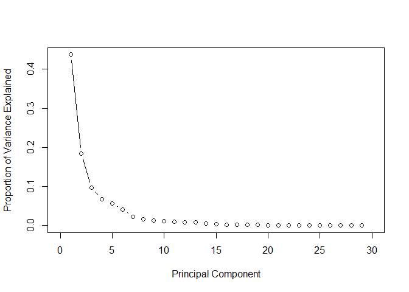<!-- -->

## ***Cumulative Variance Explained***

The cumulative of variance plot helps to choose the number of features
based on the amount of variation from original data set you want
captured. In this case, I wanted to use number of principle components
that capture almost 100% of the variation. After trying with different
number of principle components I found out that the accuracy of the
models did not increase after the 15th principle components.

``` r
cum_var <- cumsum(prop_var)
plot(cum_var, xlab = "Principal Component",
     ylab = "Cumulative Proportion of Variance Explained",
     type = "b", xlim = c(0, 30))
```

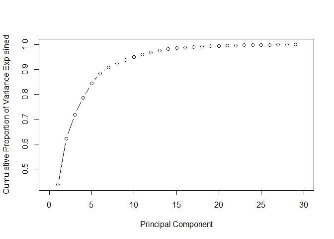<!-- -->

## ***Construct new data set***

We use the first 15 principle components as our new predictors, then we
randomly split data into training and test set in 7:3 ratio.

``` r
set.seed(100)
train_sample <- sample(1:nrow(cancer), round(0.7*nrow(cancer)))

pcadat <- data.table( label = cancer$diagnosis, pca$x[,1:15]) 
pcadat[, label := factor(label, levels = c("M", "B"))]
train <- pcadat[train_sample,]
test <- pcadat[-train_sample,]
```

# ***Model Fitting***

  - Some of the importants terms to understand: Accuracy:

\[Accuracy  = \frac{True\: positives+ True \; Negatives \;Classes}{N}\]

  - Precision: Of all the patients we predicted that they have cancer
    malignant how many actually have cancer
    \[Precision  = \frac{True \; Positives}{Predicted \; Positives}\]

  - Recall(sensitivity): Of all the patients that have malignant cancer
    how many did we detect. This is the true positive rate
    \[Recall= \frac{True \; Positives}{Actual \; Positives}\]

  - Specifity is the true negative rate. Of all the patient who did not
    have malignant tumors how many did we detect
    \[Recall= \frac{True \; Negatives}{Actual \; Negatives}\]

## ***Logistic regression***

This is one of generalized linear models which deals with binary data.
There is a generalization of this model which is called multinomial
regression where you can fit multi class data. The equation for logistic
regression model is:

\[log(\frac{p}{1-p}) = \beta_0 + \beta_1*X_1 + ... \beta_n * X_n\] and
using mle the cost function can be derived as:
\[J(\theta) = -\frac{1}{m}\sum_{i=1}^{m} y^i log(h_\theta(x^i)) + (1-y^i) log(1 - h_\theta(x^i))\]
Given that \[y = 0\] \[y = 1\] . Finding \[\beta\] s we minimizing the
cost function.

``` r
fit_glm <- glm(label ~., data = train, family = binomial)
```

    ## Warning: glm.fit: fitted probabilities numerically 0 or 1 occurred

## ***Regularization in logistic regression***

The warning “glm.fit: fitted probabilities numerically 0 or 1 occurred”
shows that there is a perfect separation/over fitting. In this case you
can load glmnet library and fit a regularized logistic regression. These
can be achieved by adding a regularization term to the cost function.The
L1 regularization(Lasso) adds a penalty equal to the sum of the absolute
values of the coefficients.

\[J(\theta) = -\frac{1}{m}\sum_{i=0}^{m} y^i log(h_\theta(x^i)) + (1-y^i) log(1 - h_\theta(x^i)) + \frac {\lambda}{2m}\sum_{j=1}^{n} |\theta^i|\]

``` r
trainx <- train[,-1]

y_train <- factor(train$label, levels = c("B", "M"), labels = 0:1)
#y <- as.numeric(as.character(y))

y_test <- factor(test$label, levels = c("B", "M"), labels = 0:1) %>% as.character() %>% as.numeric()
#ytest <- as.numeric(as.character(ytest))

testx <- data.matrix(test[, -1]) 
```

To find the optimal values \(\lambda\) we use cross validation. We
choose \(\lambda\) which gives the highest cross validation accuracy.

``` r
cv_fold <- createFolds(train$label, k = 10)

myControl <- trainControl(
  method = "cv", 
  number = 10,
  summaryFunction = twoClassSummary,
  savePredictions = "all",
  classProbs = TRUE,
  verboseIter = FALSE,
  index = cv_fold,
  allowParallel = TRUE
  
)

tuneGrid <-  expand.grid(
    alpha = 0:1,
    lambda = seq(0.001, 1, length.out = 10))
    
glmnet_model <- train(
  label ~.,
  data = train,
  method = "glmnet",
  metric = "ROC",
  trControl = myControl,
  tuneGrid = tuneGrid
)
```

s

``` r
plot(glmnet_model) 
```

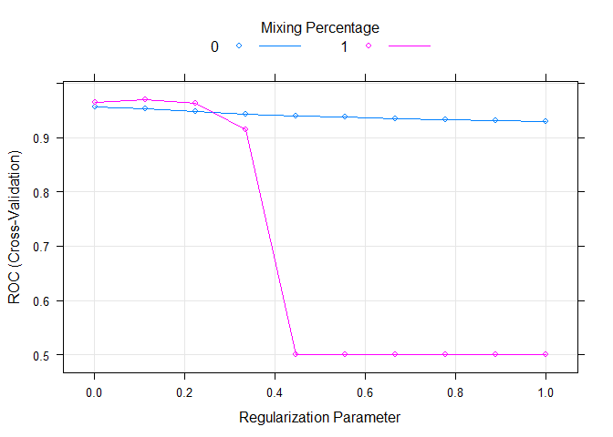<!-- -->

``` r
#lamda_min <- cv_glm$lambda.min
```

``` r
resample_glmnet <- thresholder(glmnet_model, 
                              threshold = seq(.2, 1, by = 0.05), 
                              final = TRUE, 
                              statistics = "all")

ggplot(resample_glmnet , aes(x = prob_threshold, y = F1)) + 
  geom_point() + 
  geom_point(aes(y = Sensitivity), col = "blue")
```

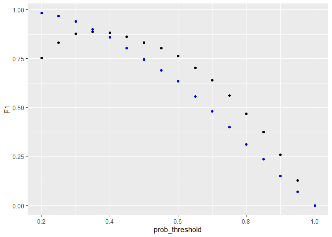<!-- -->

``` r
library(caTools)

pred_glm <- predict(glmnet_model, test, type = "prob")

colAUC(pred_glm , test$label, plotROC = TRUE)
```

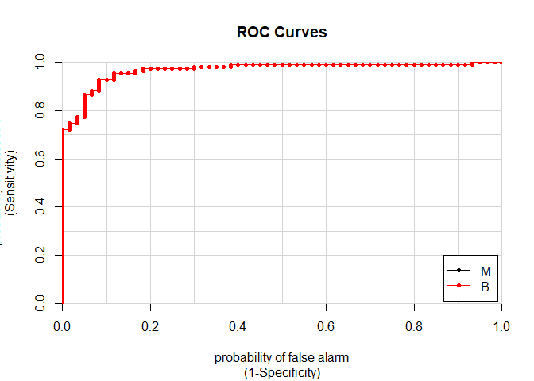<!-- -->

    ##                 M         B
    ## M vs. B 0.9683183 0.9683183

``` r
pred_glm1 <- ifelse(pred_glm[, "M"] > 0.4, "M", "B")
#pred_glm1 <- predict(glmnet_model, test, type = "raw")
```

``` r
pred_glm1 <- factor(pred_glm1, levels = levels(test$label))
```

``` r
confusionMatrix(pred_glm1, test$label,positive = "M") 
```

    ## Confusion Matrix and Statistics
    ## 
    ##           Reference
    ## Prediction   M   B
    ##          M  53   7
    ##          B   7 104
    ##                                           
    ##                Accuracy : 0.9181          
    ##                  95% CI : (0.8664, 0.9545)
    ##     No Information Rate : 0.6491          
    ##     P-Value [Acc > NIR] : <2e-16          
    ##                                           
    ##                   Kappa : 0.8203          
    ##                                           
    ##  Mcnemar's Test P-Value : 1               
    ##                                           
    ##             Sensitivity : 0.8833          
    ##             Specificity : 0.9369          
    ##          Pos Pred Value : 0.8833          
    ##          Neg Pred Value : 0.9369          
    ##              Prevalence : 0.3509          
    ##          Detection Rate : 0.3099          
    ##    Detection Prevalence : 0.3509          
    ##       Balanced Accuracy : 0.9101          
    ##                                           
    ##        'Positive' Class : M               
    ## 

## ***SVM***

Support Vector Machines is a type of supervised learning algorithm that
is used for classification and regression. Most of the times however,
it’s used for classification.

To understand how SVM works consider the following example of linearly
separable data. It’s clear that we can separate the two classes using a
straight line(decision boundary). Which is normally referred to a
separating hyperplane.

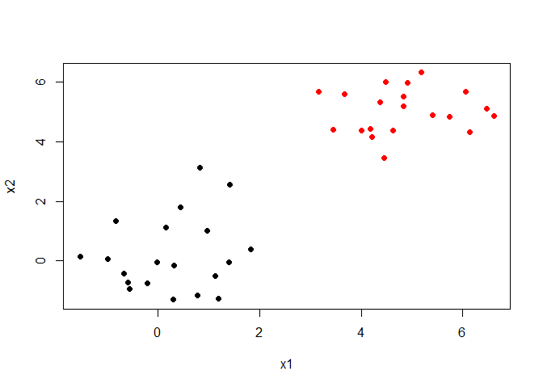<!-- -->

The question is, since there exists many lines that can separate the red
and the black classes which is the best one. This introduces us to the
maximal margin classification, In short SVM finds the hyperplane/line
that gives the biggest margin/gap between the two classes. In this case
SVM will choose the solid line as the hyperplane while the margins are
the dotted lines. The circled points that lie directly on the margin, or
on the wrong side of the margin for their class, are known as support
vectors. This shows that SVM uses this points to come up with a the
decision boundary, the other points are not used. In this case since
it’s a two dimensional space the equation of the separating line will
be \[latex\beta_0 + \beta_1X_1 + \beta_2X_2\]. Then when equations
evaluates to more than 0 then 1 is predicted
\[latex\beta_0 + \beta_1X_1 + \beta_2X_2 > 0, y = 1\] and when it
evaluates to less than zero then predicted class is -1
\[latex\beta_0 + \beta_1X_1 + \beta_2X_2 < 0, \; y = -1\] This becomes
maximisation problem \[latexwidth \; of \;the \; margin = M \]
\[\sum_{j=1}^{n}\beta_j = 1\]

\[latexy_i(\beta_0 + \beta_1X_1 + \beta_2X_2) >= M\]

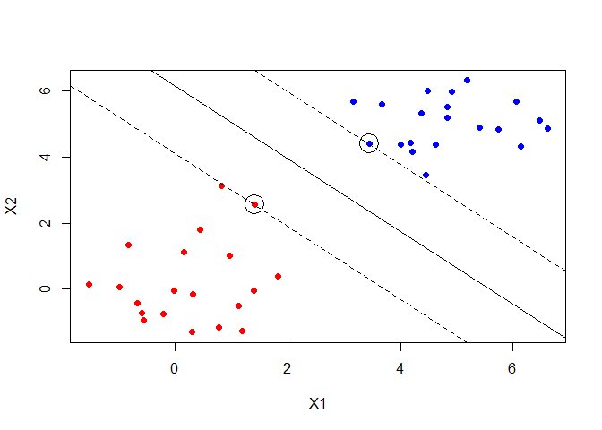<!-- -->

This is a best case scenario but in most cases the classes are noisy.
Consider the plot below no matter which line you choose some points are
bound to be on the wrong side of the desicion boundary. Thus maximal
margin classification would not work.

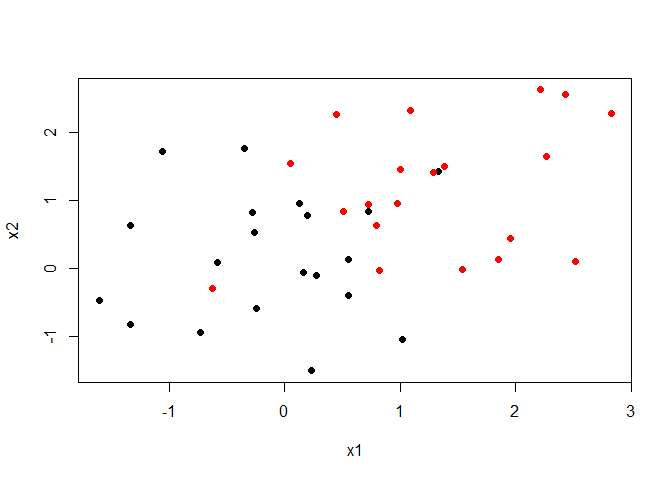<!-- -->

SVM then introduces what is called a soft margin. In naive explanation
you can think of this as a margin that allows some points to be on the
wrong side. By introducing an error term we allow for some slack. Thus
in a two case the maximisation becomes
\[y_i(\beta_0 + \beta_1X_1 + \beta_2X_2) >= M(1- \epsilon)\]

\[\sum_{i=0}^{n} \epsilon_i <= C\] C is a tuning parameter which
determines the width of the margin while \[\epsilon_i  \;'s\] are slack
variables. that allow individual observations to fall on the wrong side
of the margin. In some cases the decision boundary maybe non linear. In
case your are dealing with logistic regression you will be forced to
introduce polynomial terms which might result in a very large feature
space. SVM then introduces what are called kernels
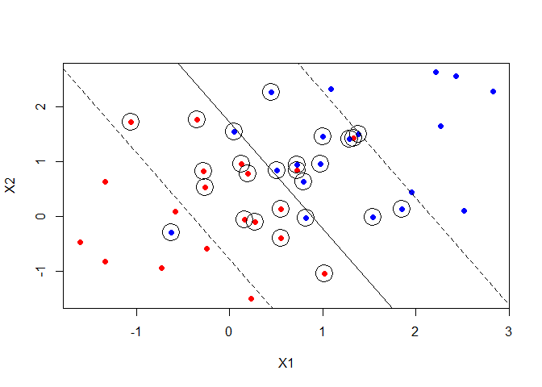<!-- -->

## ***Tuning SVM***

``` r
svm_tune <-  expand.grid(
    C =c(1 ,5 ,  10, 100, 150),
    sigma = seq(0, .01, length.out = 5))
    
svm_model <- train(
  label ~.,
  data = train,
   metric="ROC",
  method = "svmRadial",
  trControl = myControl,
  tuneGrid = svm_tune,
  verbose = FALSE
)
```

``` r
resample_svm <- thresholder(svm_model, 
                              threshold = seq(.0, 1, by = 0.05), 
                              final = TRUE, 
                              statistics = "all")

ggplot(resample_svm , aes(x = prob_threshold, y = F1, col = "F1")) + 
  geom_point() + 
  geom_point(aes(y = Sensitivity,  col = "Sensitivity"))+
  scale_x_continuous(breaks = seq(0, 1, by = 0.1))
```

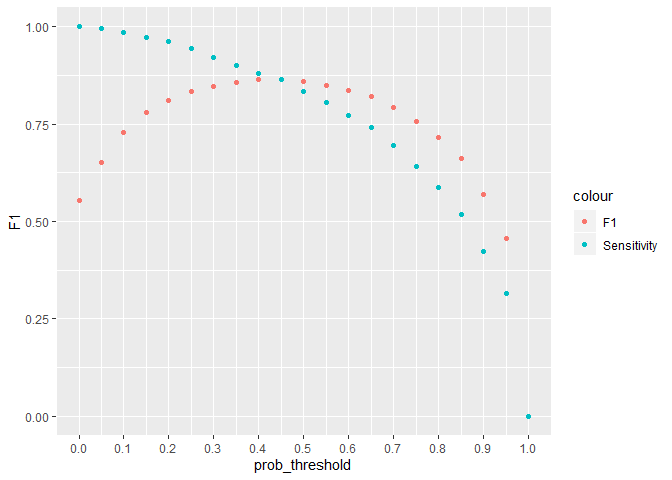<!-- -->

``` r
#mean(pred_svm == ytest)
```

``` r
pred_svm <-predict(svm_model, newdata = test, type = "prob")

pred_svm <- ifelse(pred_svm[, "M"] > 0.40, "M", "B")

pred_svm <- factor(pred_svm, levels = levels(test$label))

confusionMatrix(test$label, pred_svm, positive = "M") 
```

    ## Confusion Matrix and Statistics
    ## 
    ##           Reference
    ## Prediction   M   B
    ##          M  58   2
    ##          B   2 109
    ##                                           
    ##                Accuracy : 0.9766          
    ##                  95% CI : (0.9412, 0.9936)
    ##     No Information Rate : 0.6491          
    ##     P-Value [Acc > NIR] : <2e-16          
    ##                                           
    ##                   Kappa : 0.9486          
    ##                                           
    ##  Mcnemar's Test P-Value : 1               
    ##                                           
    ##             Sensitivity : 0.9667          
    ##             Specificity : 0.9820          
    ##          Pos Pred Value : 0.9667          
    ##          Neg Pred Value : 0.9820          
    ##              Prevalence : 0.3509          
    ##          Detection Rate : 0.3392          
    ##    Detection Prevalence : 0.3509          
    ##       Balanced Accuracy : 0.9743          
    ##                                           
    ##        'Positive' Class : M               
    ## 

## ***Xgboost***

XGBoost is a type of an ensemble learner. Ensemble learning is where
multiple machine learning algorithms are used at the same time for
prediction. A good example will be Random Forests. In random Forest
multiple decision trees are used together for prediction. There are two
main types of ensemble learners, bagging and boosting. Random forest use
the bagging approach. Trees are built from random subsets(rows and
columns) of training set and then the final prediction is the weighted
sum of all decision trees functions. Boosting methods are similar but in
boosting samples are selected sequentially. For instance the first
sample is selected and a decision tree is fitted, The model then picks
the examples that were hard to learn and using this examples and a few
others selected randomly from the training set the second model is
fitted, Using the first model and the second model prediction is made,
the model is evaluated and hard examples are picked and together with
another randomly selected new examples from training set another model
is trained. This is the process for boosting algorithms which continues
for a specified number of n.

In gradient boosting the first model is fitted to the original training
set. Let say your fitting a simple regression model for ease of
explanation. Then your first model will be
\(latex y = f(x) + \epsilon\). When you find that the error is too large
one of the things you might try to do is add more features, use another
algorithm, tune your algorithm, look for more training data etc. But
what if the error is not white noise and it has some relationship with
output \(y\) . Then we can fit a second model.
\(latex \epsilon = f_1(x) + \epsilon_1\). then this process can continue
lets say until n times. Then the final model will be

\(latex \epsilon_n = f_{n}(x) + \epsilon_{n-1}\).

Then the final step is to add this models together with some weighting
criteria \(latex weights = \alpha 's\) which gives us the final function
used for prediction.

\(y =latex \alpha * f(x) + \alpha_1 * f_1(x) + \alpha_2 * f_2(x)...+ \alpha_n * f_n + \epsilon\)

``` r
# "subsample" is the fraction of the training samples (randomly selected) that will be used to train each tree.
# "colsample_by_tree" is the fraction of features (randomly selected) that will be used to train each tree.
# "colsample_bylevel" is the fraction of features (randomly selected) that will be used in each node to train each tree.
#eta learning rate


xgb_ctrl <- trainControl(method = "cv",
                        number = 5,
                        summaryFunction = twoClassSummary,
                        classProbs = TRUE,
                        allowParallel=T,
                        index = cv_fold,
                        verboseIter = FALSE,
                        savePredictions = TRUE,
                        search = "grid")

xgb_grid <- expand.grid(nrounds = c(10, 50, 100),
                        eta = seq(0.06, .2, length.out = 3),
                        max_depth = c(50, 80),
                        gamma = c(0,.01, 0.1),
                        colsample_bytree = c(0.6, 0.7,0.8),
                        min_child_weight = 1,
                        subsample =  .7
                        
    )

    
xgb_model <-train(label~.,
                 data=train,
                 method="xgbTree",
                 trControl= xgb_ctrl,
                 tuneGrid=xgb_grid,
                 verbose=T,
                 metric="ROC",
                 nthread =3
                     
    )
```

Increasing cut of increases the precision. A greater fraction of those
who will be predicted that they have cancer will turn out that they
have, but the algorithm is likely to have lower recall. If we want to
avoid too many cases of people cancer being predicted that they do not
have cancer. It will be very bad to tell someone that they do not have
cancer but they have. If we lower the probability let say to 0.3 then we
want to make sure that even if there is a 30% chance you have cancer
then you should be flagged.

``` r
resample_xgb <- thresholder(xgb_model, 
                              threshold = seq(.0, 1, by = 0.01), 
                              final = TRUE, 
                              statistics = "all")

ggplot(resample_xgb , aes(x = prob_threshold, y = F1, col = "F1")) + 
  geom_point() + 
  geom_point(aes(y = Sensitivity, col = "Sensitivity"))+
  scale_x_continuous(breaks = seq(0, 1, by =.1))
```

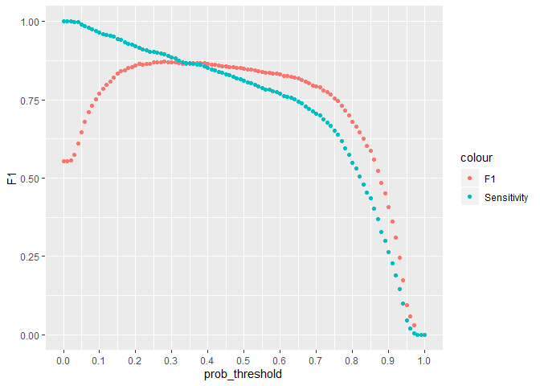<!-- -->

``` r
pred_xgb <-predict(xgb_model, newdata = test, type = "prob")
pred_xgb1 <- ifelse(pred_xgb[, "M"] > 0.4, "M", "B")
pred_xgb1 <- factor(pred_xgb1, levels = levels(test$label))

confusionMatrix(pred_xgb1,test$label,  positive = "M") 
```

    ## Confusion Matrix and Statistics
    ## 
    ##           Reference
    ## Prediction   M   B
    ##          M  59   1
    ##          B   1 110
    ##                                           
    ##                Accuracy : 0.9883          
    ##                  95% CI : (0.9584, 0.9986)
    ##     No Information Rate : 0.6491          
    ##     P-Value [Acc > NIR] : <2e-16          
    ##                                           
    ##                   Kappa : 0.9743          
    ##                                           
    ##  Mcnemar's Test P-Value : 1               
    ##                                           
    ##             Sensitivity : 0.9833          
    ##             Specificity : 0.9910          
    ##          Pos Pred Value : 0.9833          
    ##          Neg Pred Value : 0.9910          
    ##              Prevalence : 0.3509          
    ##          Detection Rate : 0.3450          
    ##    Detection Prevalence : 0.3509          
    ##       Balanced Accuracy : 0.9872          
    ##                                           
    ##        'Positive' Class : M               
    ## 

## ***Learning Curves***

``` r
sets <- seq(from = 50, to = nrow(train), by = 50)
sets[length(sets)] <-nrow(train) 
train.err <- c()
test.err<- c()
tune_grid <- expand.grid( nrounds = 50, max_depth = 50, eta = 0.06, gamma = 0.01, 
                         colsample_bytree = 0.6, min_child_weight = 1, subsample = 0.7)
for (i in 1:length(sets)) {
    
    traini = train[1:sets[i],]
    fit_svm <- train(label ~., data = traini, metric="Accuracy", method = "svmRadial",
                 trControl = trainControl(method = "none", summaryFunction = twoClassSummary,
                                          classProbs = TRUE),
                 tuneGrid = expand_grid( sigma = 0.0075, C = 5),
                 )
    
    # fit_svm <-train(label~.,
    #              data=traini,
    #              method="xgbTree",
    #              trControl= xgb_ctrl,
    #              tuneGrid= tune_grid ,
    #              verbose=T,
    #              metric="ROC",
    #              nthread =3
    #                  
    # )
    pred_train = predict(fit_svm, newdata = traini, type = "prob")
    pred_train = ifelse(pred_train[["M"]] > 0.4, "M", "B")
    train.err[i] =1 -  mean(pred_train == traini$label)
    pred_test = predict(fit_svm, newdata = test, type = 'prob')
    pred_test = ifelse(pred_test[, "M"] > 0.4, "M", "B")
    test.err[i] = 1 - mean(test$label == pred_test)
    
    cat(i," ")
    
}
```

    ## 1  2  3  4  5  6  7

``` r
train.err
```

    ## [1] 0.00000000 0.03000000 0.03333333 0.00500000 0.02000000 0.01333333
    ## [7] 0.02261307

``` r
matplot(sets, cbind(test.err, train.err), pch = 19, col = c("red", "blue"),
        type = "b", ylab = "Error", xlab = "Train sample size", main = "SVM Learning Curves")
legend("topright", legend = c("Test", "Train"), pch = 19, col = c("red", "blue"))
```

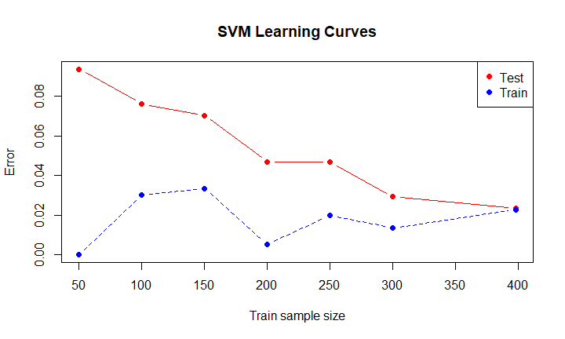<!-- -->

## ***Error Analysis***

Look at the examples that the algorithm misclassified to see if there is
a trend. Generally you are trying to find out the weak points of your
algorithm. Checking why your algorithm is making those errors. For
instance, from the boxplots below the malignant tumors that were
misclassified had lower radius mean compared to mislassified benign
tumors. This contrary to what we saw in the first boxplots graph.

``` r
df <- data.frame(cancer[-train_sample,], pred_svm) %>%
    setDT()


test_mis_svm <- df[(diagnosis == "M" & pred_svm == 0) |( diagnosis == "B" & pred_svm == "M")]
```

``` r
# test_mis_svm_m <- melt(test_mis_svm, 
#                 id.vars = c("diagnosis", "pred_svm"))
# 
# ggplot(test_mis_svm_m , aes(x = pred_svm, y = value))+
#     geom_boxplot() + facet_wrap(~variable, scales = "free_y")
```
